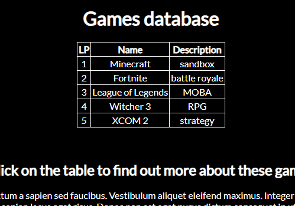
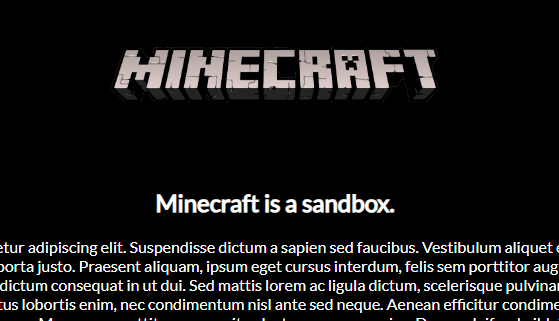

# PHP-ID-recognition
Database connected with PHP file. ID value from database will affect PHP appearance.  
  
<i>index.php</i> is connected to localhost to display content of <i>games.sql</i>.  
  
After we click on something in the table <i>game.php</i> is opened. Content of this file depends of id (or game title/description connected to this id) we clicked.

<b>It is test to check how PHP gets values from database.</b>
